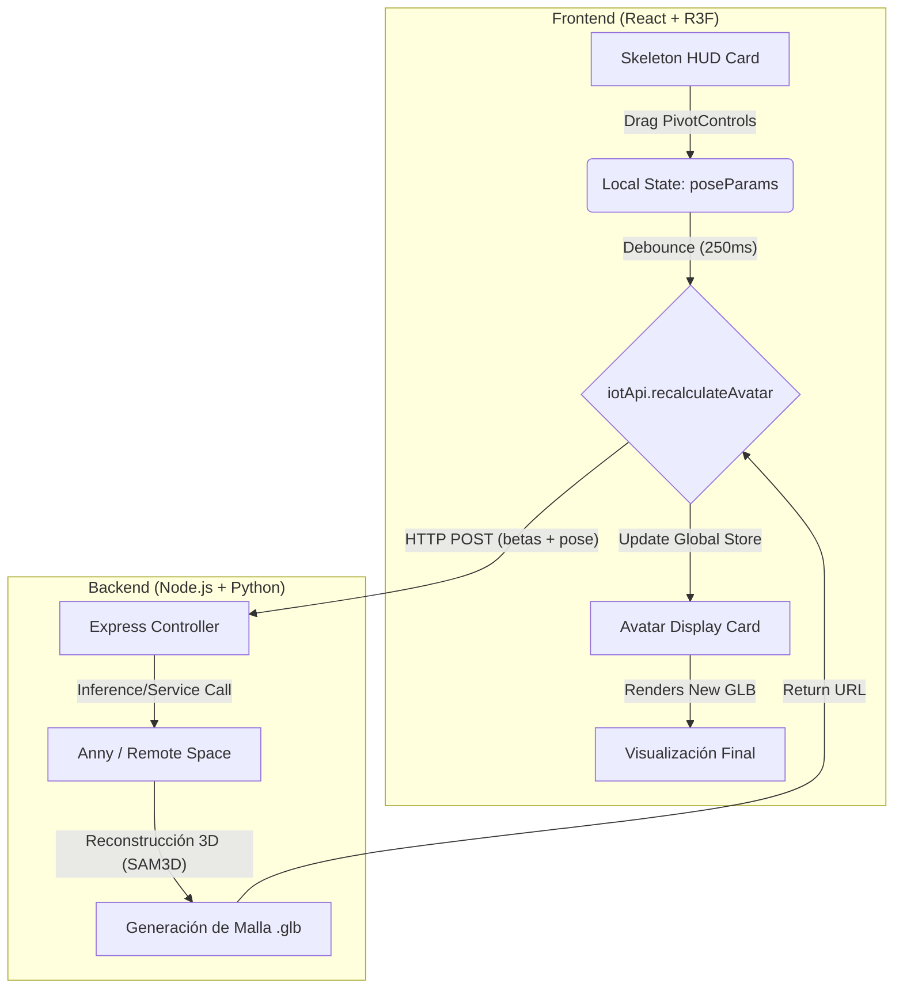

# Arquitectura Técnica: Módulo de Ajustes de Pose (`AjustesPose.jsx`)

Este módulo funciona bajo una arquitectura de **Digital Twin (Gemelo Digital)** donde un esqueleto cinemático simplificado controla una malla biométrica de alta fidelidad en el servidor.

## 1. Flujo de Datos y Sincronización

## 2. Componentes de la Capa de Presentación (3D)

### A. Vista de Salida (Avatar 3D)
*   **Tecnología**: `react-three-fiber` + `useGLTF`.
*   **Función**: Renderiza el modelo `AvatarRealGLB` obtenido del servidor.
*   **Estado**: Reactivo a `posedMeshUrl`. Recalcula la escala basándose en las medidas físicas del usuario (`targetScale`).

### B. Consola de Mando (Skeleton HUD)
*   **Tecnología**: `@react-three/drei` (`PivotControls`, `Stage`).
*   **Lógica IK**: Utiliza controles de pivote en los ejes específicos (Shoulder: Z-axis, Elbow: Y-axis).
*   **Mapping**: Traduce matrices de rotación 3D del mundo a ángulos de Euler locales compatibles con los parámetros de pose de SMPL-X.

## 3. Gestión de Estado

*   **Zustand (`useAvatarStore`)**: Sincroniza la URL de la malla y los parámetros biométricos (betas) entre el Laboratorio IA, el Probador y este módulo.
*   **Persistence Layer**: Implementa hidratación desde `localStorage` para recuperar el avatar activo tras un refresco de página.
*   **Local State**: Gestiona la interacción inmediata (sliders, selección de articulaciones) para desacoplar el renderizado de la UI del pesado proceso de redibujado 3D.

## 4. Pipeline de Optimización
*   **Debouncing**: Las peticiones al servidor están limitadas a una cada 250ms para evitar sobrecargar el motor de inferencia Python.
*   **View Isolation**: El uso de dos Canvases independientes permite que la interacción con el esqueleto sea a 60 FPS sin verse afectada por la latencia de red de la descarga del modelo GLB principal.
*   **Blueprint Grid**: Sistema de rejilla CSS/Three para proporcionar referencias espaciales al usuario durante el posado anatómico.
